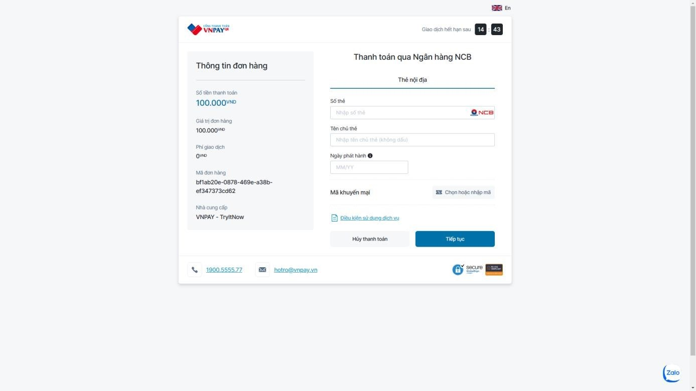

# Drawing courses selling platform

Nowadays, the need for children to learn how to draw is very large, parents always want to have drawing courses to help their children improve their thinking and create a love for painting. However, in the market, the appearance of websites selling online courses is increasingly popular, including a few examples such as Udemy or Edumall, which are both websites selling online courses in a variety of fields, majors or subjects. But those platforms do not focus on developing a certain field for the community of art lovers. Besides, having to study at drwaing centers causes many time constraints. Most of a child's free time is focused on other school subjects such as Math, English, etc. Therefore, a platform that provides drawing courses will help parents and children access drawing lessons quickly, can learn comfortably without spending a lot of time and effort.

## Description:

- The program support authentication for 3 types of account 
  - Admin: Allowed to manages the entire platform as well as all users' accounts.
  - Staff: Allowed to manage customer and teacher accounts, as well as manage forum information.
  - Instructor: Allowed to create courses and sell courses on the website. Besides, teachers can view reports on the number and revenue earned from courses purchased by customers.
  - Customer: Allowed to log in to the website, then can search and try courses before deciding to buy.

## Implementation:

### Login & Register
#### Login

#### Register

---

### General
#### Forgot Password

#### View Personal Information

---

### Admin Function:
#### Manage Staff

#### Manage Instructor

#### Manage Customer

#### View Statics for Admin

---

### Staff Function:
#### Manage Instructor

#### Manage Customer

#### Manage Instructors' courses

#### Manage Forum

#### View Statics for Staff

---

### Instructor Function:
#### Manage Courses

#### Update Courses

#### Add Course

#### Attend Forum

#### View Statics for Instructor

---

### Customer Function:
#### View Course's Information

#### Pay to learn course

#### View Registered Courses

#### View Unregistered Courses

#### View Order History

#### Attend Forum

